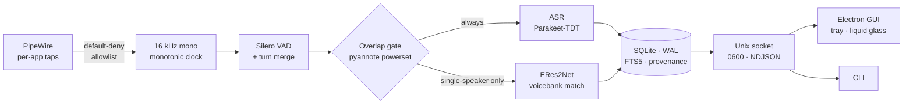

<div align="center">

# ◢ NX RECALL ◣

### Total recall for your social life. On your silicon. Nowhere else.

**The always-on conversation memory for VR — local transcription, persistent
speaker identity, instant search. Zero cloud. Zero telemetry. Zero exceptions.**

<br>


<br>

*"wait — what did she say about that world?"*

**Now you know. Forever. And nobody else does.**

</div>

---

## The problem nobody shipped a fix for

You spend your evenings in VRChat lobbies where five conversations run at once
through one spatialized stereo mix. You meet someone brilliant, talk for an hour,
and three days later you can't remember their name, their voice, or the world they
recommended. Every cloud transcription product would happily fix this — by
uploading your friends' voices to someone else's datacenter.

That is not a fix. That is a breach with a subscription fee.

**NX Recall is the other path**: a Rust daemon that captures audio only from apps
you explicitly allow, transcribes it on your CPU, recognizes *who* said it with
voice fingerprints that never leave your disk, and hands you a search box over your
own social memory. The GPU keeps rendering your headset. The network cable stays
cold.

## Engineering you can audit, numbers we actually measured

This project runs on receipts, not vibes. Before writing the daemon we built a
measurement harness ([`spike/`](spike/FINDINGS.md)) and let it kill our own
assumptions — two of the original design's core claims died in the lab, and the
architecture is what survived.

| Claim | Measured |
|---|---|
| Transcription accuracy (clean) | **1.3% WER** — Parakeet-TDT, fully offline |
| VRChat's voice codec "quality ceiling" | **Debunked**: Opus down to 8 kbps costs 0.2 pp WER, ~0.02 cosine for identity |
| Speaker ID from 1 second of speech | **96% coverage, 2.5% EER** |
| Real lobby, 20 min field recording | **9.8% overlapped speech** — the failure regime is rare in the wild |
| Two named friends | cover **38% of all lobby speech**; ~95% of their later speech auto-matches |
| ASR ghost words on silence / noise / music | **Zero.** (Whisper hallucinated on all three; so Whisper isn't in the default stack) |
| Full pipeline: VAD → overlap gate → ASR → speaker ID | **< 5% of one CPU core** — your framerate never hears it |
| Equal-loudness crosstalk (the poison case) | **Detected and refused** — 0.0% false alarms on single-speaker audio |

The last row is the moat. Every naive approach confidently mislabels overlapping
speakers ~50% of the time — and confidence scores *cannot see it* (we tried the
cheap defenses; they're falsified in [FINDINGS.md](spike/FINDINGS.md) so nobody
retries them). NX Recall runs an independent overlapped-speech detector and would
rather tell you *"two people were talking"* than write the wrong name into your
memory. A missed label costs a shrug. A false one corrupts the voicebank forever.
We chose accordingly.

## Architecture



- **Default-deny capture.** Unknown apps trigger a history entry, never a recording.
  VRChat in, banking tab out, forever.
- **Label, don't separate.** Voice timbre is invariant to the exact things VR
  scrambles — position, distance, head movement. We fingerprint, tag, and thread
  conversations after the fact.
- **Two-threshold identity.** Labeling and enrollment are separate gates; automatic
  enrollment additionally requires the overlap detector's blessing. The voicebank
  cannot poison itself on a confident mistake.
- **Everything has provenance.** Every segment carries its model IDs, confidence,
  and overlap fraction. Reprocess-proof. Merge tombstones never chain. Renames are
  retroactive and broadcast live to every client.
- **Deletion means deletion.** Delete-by-speaker is a first-class cascade with a
  preview (`Kira: 1,247 segments, 31 hrs, 340 MB — confirm?`), soft-delete undo
  window, nightly purge, `VACUUM`, and a sweeper that reconciles loose audio files
  against the database.

## Quickstart

```bash
cargo build --release
./target/release/recalld probe          # see every app making sound, none captured
./target/release/recalld allow VRChat.exe
./target/release/recalld run            # first light
./target/release/recalld search "that portal world"
```

Pause lives in the tray dropdown and the GUI — instant, zero writes.

## What never leaves this machine

| Artifact | Lives | Leaves |
|---|---|---|
| Audio segments | encrypted disk, retention-capped (default: days) | never |
| Transcripts | SQLite on your disk | never |
| Voice fingerprints | your voicebank | never |
| Golden enrollment samples | your disk, retention-exempt | never |
| Telemetry, analytics, crash reports | nowhere — they don't exist | n/a |

No network calls at inference time. Models are fetched once at setup, then the
feature is done having opinions about the internet. This repo is private by design
and the software contains **no export or sharing surface at all** — that's not a
missing feature, it's the [legal architecture](docs/DESIGN.md#12-legal-note).

## Status

| Milestone | State |
|---|---|
| 0 · Measurement spike (identity + ASR + field recording) | ✅ shipped, [findings public to the repo](spike/FINDINGS.md) |
| 1 · Capture · VAD · allowlist | ✅ first light on a live 40-player lobby |
| 2+3 · ASR · voicebank · overlap gate | ✅ 149 tests, golden fixtures enforced |
| 4 · Socket protocol · tray · GUI | 🔨 in flight |
| 5 · Roster integration · NX Hub packaging · Windows | 🗺 mapped |

Golden fixtures gate every change: the equal-loudness mixes carry
`expect: refuse` — a pipeline that labels them "correctly" by luck **fails CI**.

## The NX suite

Recall runs alongside [nx-hub](../nx-hub), [nx-orbit](../nx-orbit), and the rest of
the NX family — liquid glass on deep space, `#7700FF`, local-first to the bone.
Orbit integration is deliberately one-way and manual: Recall may read Orbit's
name-picker once; **nothing ever flows back**. Orbit's charter stays clean.

---

<div align="center">

**Built for one user, at full send.**

*Your lobbies. Your friends. Your memory. Your hardware.*

◢ **NX** ◣

</div>
