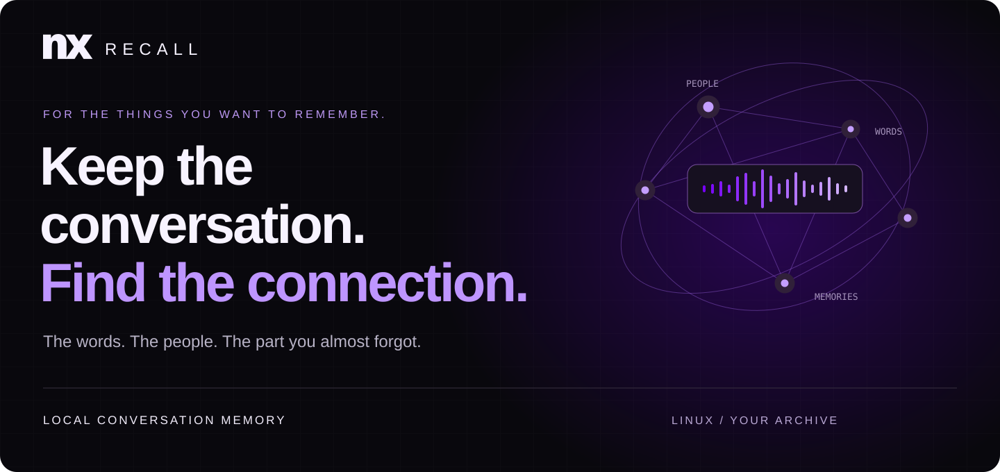
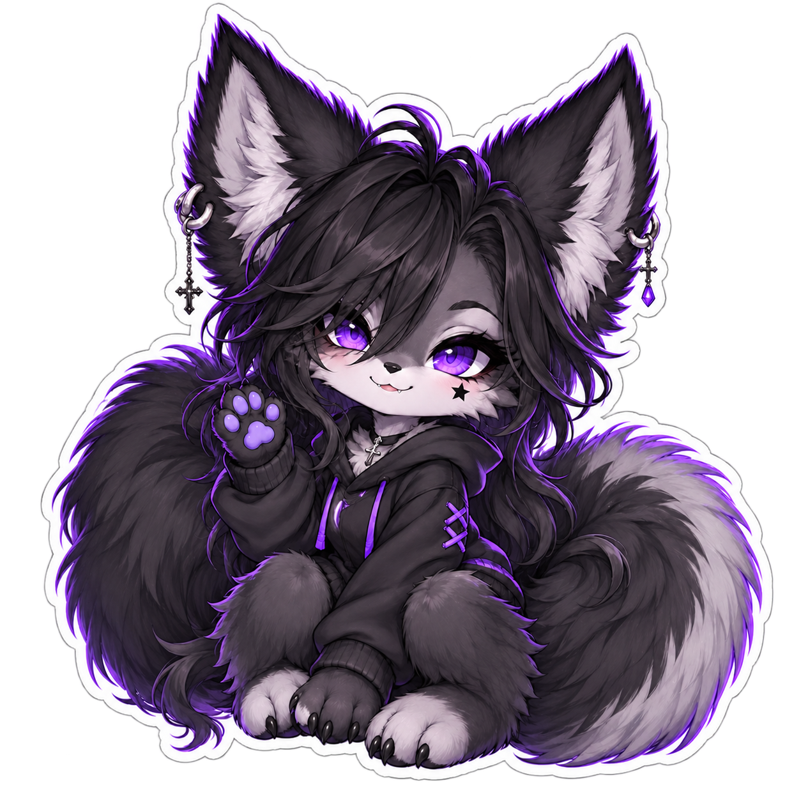
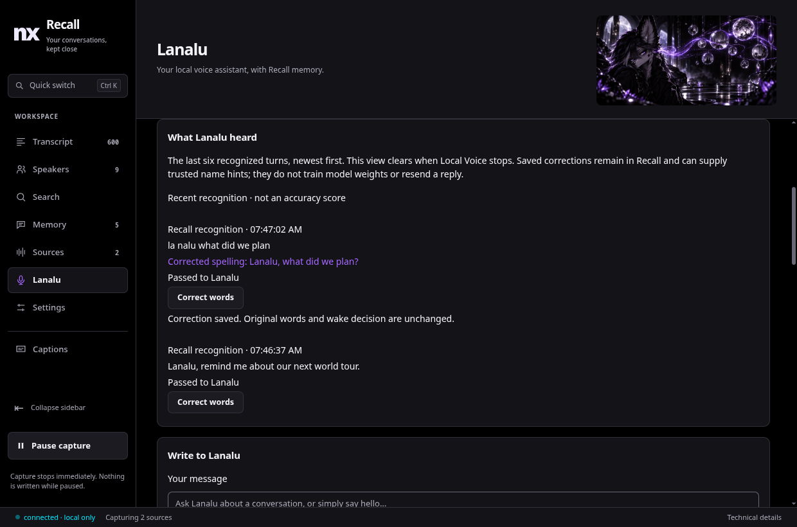

<div align="center">



# Your conversations have a life after the call.

The world someone recommended. The promise you made. That one story you wanted to hear again.

**NX Recall turns permitted audio into a searchable, local archive — with the words, the people, and a way back.**

[](https://github.com/nerdrx/nx-recall/releases/latest) [](https://github.com/nerdrx/nx-hub)

**Local AI · No telemetry · Capture by choice · Linux**

[Take the tour](#find-the-part-you-almost-forgot) &nbsp; / &nbsp; [Meet Lanalu](#a-little-floof-a-voice-for-your-memories) &nbsp; / &nbsp; [Get started](#your-first-memory-starts-here)

</div>

<br>

<table>
<tr>
<td width="33%" valign="top">

### Find that thing.

**“What was that world called?”**

Search words or related meaning. Jump back into the conversation. Semantic search is optional.

</td>
<td width="33%" valign="top">

### Remember your people.

**“When did we last talk about this?”**

Name familiar voices. Revisit their conversations. Keep the context.

</td>
<td width="33%" valign="top">

### Keep the good bits.

**“I don't want to lose this.”**

Save moments, notes and collections. Export a conversation as Markdown.

</td>
</tr>
</table>

<br>

## Find the part you almost forgot.

From a live conversation to the exact turn you came looking for. Captions keep up with permitted sources; your archive stays around when the call is over.


<sub>Real desktop UI, fictional demonstration conversations. All product screenshots on this page use test data.</sub>

**Search it. Open it. Hear it again.** Replay original audio while it is retained. Correct a word when the recognizer misses. Review uncertain speaker matches instead of trusting a label that only looks certain.

<br>

## A memory you can come back to.

A transcript remembers the words. Recall gives you places to put the meaning: **people, topics, saved moments, notes, collections, and commitments**.


| Keep something close | Follow the thread | Check the source |
| :--- | :--- | :--- |
| Save a moment and give it your own note. Collect conversations that belong together. | Optional local models summarize conversations and help connect topics and commitments. | Return to the original turns behind a summary. Your archive remains useful without a language model. |

<details>
<summary><strong>What if Recall gets a name wrong?</strong></summary>

Correct the words in the transcript; name the person with a speaker label. They serve different purposes.

Optional **corrected-name assistance** uses trusted spellings as hints for future recognition. It can substitute a trusted name while preserving the other recognized words. This is experimental, defaults off, and does not retrain model weights or rewrite your old archive.

[How corrected-name assistance works →](docs/NAME-ASSISTANCE.md)

</details>

<br>

## A little floof. A voice for your memories.

<table>
<tr>
<td width="34%" align="center" valign="middle">

</td>
<td width="66%" valign="middle">

### Meet Lanalu.

**“Lanalu, what did we say about the world tour?”**

Ask out loud, or type when the room is quiet. Lanalu can use relevant excerpts from your Recall archive to help answer.

She has **her own tab**, written input, voice controls, and a Debug window that tells you whether she is listening, thinking, speaking, or waiting.

**Your memories. A familiar voice. Running on your computer.**

[Explore Local Voice →](docs/LOCAL-VOICE.md)

</td>
</tr>
</table>


**See what she heard. Correct what she missed.** Live audio meters show whether sound is arriving. Her recent-turn panel shows the recognized words—even when she misses her wake name. Correct a spelling in place and save it as a labeled example; optional trusted-name assistance can help future recognition.

<details>
<summary><strong>Give a missed name its proper spelling</strong></summary>



</details>

### Make her sound like her.

Keep fast **Amy**, or choose **Heart, Bella, Sarah, or Nicole** with optional Kokoro speech. Adjust the speaking pace; Amy also offers voice variation. Kokoro plays each native sentence chunk as it becomes ready.

**No paid inference API.** The language model and speech engines run locally. Optional voice setup downloads the models first.

<details>
<summary><strong>Look inside the voice controls</strong></summary>


</details>

### At your desk. Or in the conversation.

| Local audio | Virtual in/out |
| :--- | :--- |
| Choose your microphone and speakers or headphones. Speak or type. Listening pauses during local playback to reduce feedback. | Private virtual audio devices connect a supported, selected voice client. Incoming speech can interrupt Lanalu's reply. |

Reuse **Recall's recognizer** for the same captured input, or choose a separate recognizer. Listen for a wake name, or respond to each detected turn. You control when she starts.

<details>
<summary><strong>Before you bring Lanalu into a call</strong></summary>

- The voice client stays human-controlled: you log in and join the call. Recall does not automate your Discord account. Other clients and desktop defaults are left alone; stopping Local Voice restores the routes it changed.
- Memory answers are audible to everyone in the call and may contain information from your archive. Model replies can be wrong; check the original turns when it matters.
- Shared recognition requires Recall to capture the same input. Confident, recent named acoustic matches can identify people on the selected virtual input. Uncertain or overlapping speakers stay unknown; local microphone mode leaves speakers unnamed. A voice match is not authorization.
- Routing keeps generated output away from the incoming capture path. Remote microphones can still echo; this is not an acoustic echo canceller.
- The included Local Voice choices and separate recognizer use English. Lanalu can continue in the tray and stops when you quit Recall. Setup does not start listening; autostart is a separate choice.

[Audio setup, models, compatibility and limits →](docs/LOCAL-VOICE.md)

</details>

<br>

## Close to you. Kept by you.

**Your conversations belong on your computer.** Audio, transcripts, speaker fingerprints and search data stay local for processing. No cloud transcription. No telemetry.

<table>
<tr>
<td width="33%" valign="top">

### You choose the input.

Allow applications and enable microphones in Sources. Pause capture from the app or tray.

</td>
<td width="33%" valign="top">

### You decide what stays.

Set audio retention. Review uncertain recognition. Delete records when you no longer want them.

</td>
<td width="33%" valign="top">

### You can take it with you.

Export Markdown. Create verified backups. Keep your data and models across updates and uninstall.

</td>
</tr>
</table>

<sub>Installation, model setup and updates use the network. Local inference does not send conversations to an inference API. Enabling call output sends generated speech through your voice client.</sub>

<br>

## Your first memory starts here.

**Linux x86-64 · PipeWire · systemd user session**

1. **Install Recall** with [NX Hub](https://github.com/nerdrx/nx-hub) or the [latest Linux release](https://github.com/nerdrx/nx-recall/releases/latest). The package includes the recording daemon, desktop app, tray and captions overlay.
2. **Prepare the speech models** and start recording with the commands below. Then allow your applications or microphone in **Sources**.
3. **Make your first memory.** Name a familiar voice, save a moment, or search a conversation. Add Lanalu whenever you want a voice for the archive.

```bash
~/.local/bin/recalld models fetch
systemctl --user daemon-reload
systemctl --user enable --now nx-recall
```

[Complete installation guide →](docs/REFERENCE.md#install-on-linux)

<details>
<summary><strong>Add semantic search, summaries, or Lanalu when you're ready</strong></summary>

Semantic search and conversation summaries have optional model downloads:

```bash
~/.local/bin/recalld models fetch --semantic
~/.local/bin/recalld models fetch --graph
```

For spoken conversation, open **Lanalu → Set up Local Voice**. Setup downloads about **3 GB** of models plus Python packages, reusing existing files. Allow at least **4 GB free disk space**, or **5 GB** for a fresh setup with optional Kokoro voices. Kokoro adds about **350 MB** of downloads.

Local Voice requires Python 3.11+, FFmpeg, PipeWire-Pulse and working Vulkan drivers. Select your audio and listening modes before **Start Local Voice**. Shared recognition needs the same input captured by Recall.

Qwen3.5-4B generates Lanalu's replies and is also available to Recall's memory writer. Shared recognition uses Recall's selected speech model; separate recognition uses English Parakeet. Piper and optional Kokoro generate speech locally.

Data and models live under `~/.local/share/nx-recall` and survive updates and uninstall.

</details>

<br>

## Built to be opened up.

**Rust recording daemon · SQLite archive · Electron desktop · Optional Python voice worker**

Recall exposes processing delays and recording gaps, links generated summaries to source turns, and documents its interfaces.

| Use it | Understand it | Build on it |
| :--- | :--- | :--- |
| [Desktop guide](docs/UI.md) | [Reliability and limits](docs/RELIABILITY.md) | [Build from source](docs/REFERENCE.md#build-from-source) |
| [Local Voice](docs/LOCAL-VOICE.md) | [Memory graph](docs/GRAPH.md) | [Local protocol](docs/PROTOCOL.md) |
| [Releases](https://github.com/nerdrx/nx-recall/releases) | [Measurements](spike/FINDINGS.md) | [Design system](docs/DESIGN.md) |
| [Report an issue](https://github.com/nerdrx/nx-recall/issues) | [Changelog](CHANGELOG.md) | [Explore the NX family](https://github.com/nerdrx/nx-hub) |

<sub>Desktop captions use a native Wayland surface. The separate [OpenXR headset overlay](docs/OVERLAY.md) is experimental and has not been validated in a live WiVRn session.</sub>

---

<div align="center">


### Keep the story going.

**Same people. New conversations. More remembered.**

[](https://github.com/nerdrx/nx-recall/releases/latest)

</div>
