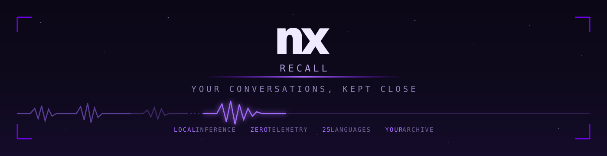
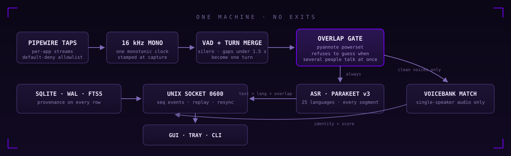

<div align="center">



<br>

**The always-on conversation memory for VR and voice chat. Transcription in
25 languages, persistent speaker identity, a memory graph, search by meaning,
desktop captions over whatever you are doing, and a night shift that re-reads
the day on your own GPU. Processing stays on your machine, with no cloud
transcription or telemetry.**

<br>


<br>

*"wait — what did she say about that world?"*

**Find the moment. Remember the conversation.**

</div>

<br>

## Install on Linux

The published desktop build is for **Linux x86-64**. It needs PipeWire and a
systemd user session. Install the signed release through
[NX Hub](https://github.com/nerdrx/nx-hub), or download it from the
[latest NX Recall release](https://github.com/nerdrx/nx-recall/releases/latest).
NX Hub installs the daemon, desktop client, tray, captions overlay and user
service under `~/.local`; it leaves your data and models in
`~/.local/share/nx-recall` alone during updates and uninstall.

After installation, fetch the speech models and start the service once:

```bash
~/.local/bin/recalld models fetch
systemctl --user daemon-reload
systemctl --user enable --now nx-recall
```

Then choose what Recall may hear. Capture is default-deny:

```bash
~/.local/bin/recalld probe
~/.local/bin/recalld allow VRChat.exe
systemctl --user restart nx-recall
```

Semantic search and model-written conversation summaries use optional local
model sets. Saved moments, saved searches, and browsing recorded days do not
require those models. Fetch them when you want the model-assisted features:

```bash
~/.local/bin/recalld models fetch --semantic
~/.local/bin/recalld models fetch --graph
```

Desktop captions use a native Wayland layer surface. The OpenXR headset
overlay is experimental, ships behind `--overlay`, and has not yet been
validated against a live WiVRn session.

```console
$ recalld probe
 NODE   MATCH KEY    APPLICATION           PID     CAPTURE
  190   VRChat.exe   VRChat.exe            635606  unknown (default-deny)
  313   Discord      WEBRTC VoiceEngine    4206    unknown (default-deny)
  380   firefox      Firefox               6917    unknown (default-deny)

$ recalld allow VRChat.exe

$ recalld ask "was hat Aspen gestern über den Shader gesagt?"
speaker Aspen · gestern 00:00 → heute 00:00 · query "Shader"
21:14  Aspen  Der Shader kompiliert nicht, wenn die Textur größer als 4k ist …

$ recalld graph commitments
open  Rowan → You   "den Link schicken"   due morgen (resolved: Do 03.09)

$ recalld truth report
identity scored on  126 clean Discord turns Discord itself attributed
  precision  88.5%     recall  85.8%     wrong  15     declined  4
```

Nothing is recorded until you say so. Then everything you allow becomes
searchable — by word, by meaning, by speaker, by day, by world — and a 1.9 GB
model on four polite CPU cores quietly writes down who promised what, while a
1 GB model on your GPU re-reads the hard parts at three in the morning.

## Find and keep a moment in 0.14

- **Search with a visible date scope.** Choose Last 7 days, All history, or a
  custom range. Expand a result to read nearby turns from the same conversation
  without losing the query, or open the source in Transcript. Date-only searches
  can browse a day without inventing a keyword.
- **Save what matters.** Save a query with its filters, or bookmark a turn and a
  short consecutive range with an optional title and personal note. Saved
  rolling dates are resolved when reopened; fixed dates stay fixed. Memory's
  Saved tab lets you reopen, edit, remove, and page through saved items.
- **Browse Memory.** Recent holds summaries, notes, places, and topics; By day
  pairs summaries with retained transcript previews, including time, speaker,
  and source. Commitments have their own tab. Missing summaries do not hide
  the recorded words, and failed loads offer a retry.
- **A calmer desktop.** Processing, translation, sound interpretation, and
  recognition-quality controls live in Settings. Choose comfortable or compact
  spacing there. Capture consent, captions, storage, and backup controls remain
  in Sources. The footer separates capture status from technical details.
- **Keyboard access.** Ctrl/Cmd+F opens Search, including from an ordinary input;
  Ctrl or Alt + 1–6 switches views. Memory tabs support arrow keys. Dialogs keep
  focus inside while open and return it on close; the speaker picker can filter
  a long list of voices by name.

Saved moments are references to original turns, not extra recordings. They
reflect transcript corrections and obey deletion and retention: unavailable
turns disappear from the saved excerpt, and a moment with no retained source
turns is omitted. Personal notes are labeled separately from the original words.

The semantic index also does less bookkeeping: metadata-only changes avoid
rewriting full-text entries, status reads avoid loading/refitting the index, and
query inference and ranking use an immutable snapshot outside the database
lock. Transactional vector tracking and final freshness checks protect against
stale edits and deletions. Corrected archive text is queued durably for the
existing `recalld semantic backfill` command; this release adds no automatic
background reindex scheduler. See [CHANGELOG](CHANGELOG.md) for measured scope
and [PROTOCOL](docs/PROTOCOL.md) for the saved-item APIs.

## The problem nobody shipped a fix for

You spend your evenings in lobbies where five conversations run at once through
one spatialized mix. You meet someone brilliant, talk for an hour, and three
days later you cannot remember their name, their voice, or the world they
recommended. Every cloud transcription product would happily fix this — by
uploading your friends' voices to someone else's datacenter.

That is not a fix. That is a breach with a subscription fee.

**NX Recall is the other path**: a Rust daemon that captures audio only from
apps you explicitly allow (plus, if you switch them on, your own headset
microphone and a room microphone), transcribes everything locally, recognizes
*who* said it with voice fingerprints that never leave your disk, threads the
interleaved lobby back into its separate conversations, scores its own
accuracy against the only ground truth that exists, and answers questions you
no longer remember the words to. The GPU keeps rendering your headset until
you take it off. The network cable stays cold.

## The pipeline



Live, per turn, about half of one core: PipeWire tap → Silero VAD →
turn merge → pyannote **overlap gate** → Parakeet-TDT v3 → ERes2Net
voiceprint → identity ladder → thread → FTS5 and a 384-dimension vector.

All of that is on the CPU, and it stays there. The obvious question — the
7900 XTX is idle, the night shift already uses it, why is the transcriber on
four cores? — was measured on 22.8 minutes of real turns and the answer was
no. Nine tenths of the live cost is Parakeet; Parakeet runs under sherpa-onnx,
whose provider list is `cuda`, `coreml`, `xnnpack`, `nnapi`, `trt`, `directml`
and **nothing for AMD**. The two models that *could* move are 1.1% of the bill
between them and want 19 GB of ROCm math libraries installed system-wide to do
it. A GPU decoder was built and benchmarked anyway: invoked once per turn it
was **slower to answer than the CPU it replaced** (1639 ms against 360 ms) and
not cheaper, because the model load is the cost and a live decoder cannot
batch it away the way a night shift can. So there is no `live_gpu` setting —
all three of its states would do the same thing — and `recalld status` says
which device every model is on and why instead. Full round in
[public measurement overview](spike/FINDINGS.md).

Then the parts that run when nobody is waiting: a **context re-decode** that
re-reads short turns inside the audio around them, a **cross-check** by a
second decoder that marks disagreements *shaky*, the **language arbiters**
for suspected flips, a jailed 3B **language model** for promises, topics,
digests and translations, the **ground-truth pass** that scores the voicebank
against Discord's own word, and the **night shift**: whisper-large-v3 on the
GPU, replacing words only under a two-of-three vote.

A turn ends at silence, so a fast exchange — *"yeah" / "no it isn't"* across
half a second — lands as one row with one name. `recalld turns resplit` cuts
those rows apart: it slides the same voiceprint model along the turn, finds
where the person talking changes, and writes each piece as an ordinary turn
with its own clip and its own label. The transcript is **partitioned by word
time, never re-decoded** — the pieces' words are the turn's words, in order,
with none lost at the cut and none spelled twice. Measured against Discord's
own per-user spans it finds two changes in five and splits fewer than one
percent of turns Discord says are one person, which is why it runs as a pass
you read and can undo rather than as a live default. On this archive it turned
93 rows the voicebank could never be scored against into ground truth, and took
held-out identity precision from 85.7% to 86.8%.

The box that earns its keep is the overlap gate. Every naive approach
confidently mislabels overlapping speakers about half the time — and
confidence scores *cannot see it happening*. NX Recall would rather write
*several voices* than write the wrong name into your memory. A missed label
costs a shrug. A false one corrupts the voicebank forever. The same philosophy
repeats at every layer: the ASR outputs **nothing** on dense babble where
lesser models invent sentences; the promise extractor was chosen for refusing
all nine trap cases, not for finding the most promises; the night shift ships
the *second-best* vote rule because the best one wrote two German lines in
Swedish; and identity is a ladder where *creating* a voice costs more evidence
than labeling one, and *enrolling* costs more than creating:

```
label (0.35, calibrated on real lobbies — the corpus value over-split 3×)
  < mint  (2 s of speech AND 2 real words — grunts stop becoming people)
    < enroll (0.55 + margin + overlap-clean + 3 s — the bank cannot poison itself)
      < truth (Discord says it was them, ≥3 s, ≥95% coverage — the only free lunch)
```

## Numbers we actually measured

The measurement harness came first — **38 experiment scripts and twenty-five
historical findings**, now condensed into the privacy-safe [`measurement overview`](spike/FINDINGS.md) — and two of
the original design's core claims died in it before a line of the daemon
existed. Every feature since has had a gate it had to clear, and the ones that
failed are listed further down with their numbers.

| Claim | Measured |
|---|---|
| Transcription | **1.4% WER English, 8.4% German** — one model, no mode switch |
| What the old English-only model made of German | 103% WER — *"The Vision Shaftwise Nooner of Hindus Deemers"* |
| VRChat's voice codec as "quality ceiling" | Debunked — Opus to 8 kbps costs ~0.2 pp WER, ~0.02 cosine |
| Speaker ID from one second of speech | 96% coverage, 2.5% EER |
| A real 20-minute lobby | **9.8% overlapped speech** — the failure regime is rare in the wild |
| Two named friends | cover 38% of all lobby speech; ~95% of their later speech auto-matches |
| Ghost words on silence / noise / music | Zero. |
| Language flips on 1-second German fragments | 12% read as English — hence the conversational prior |
| The promise model's trap-rejection | 9/9 — banter, suggestions, past tense, hypotheticals, absent third parties |
| Cross-language search, German query → English memory | mean rank 2.7 after the language-hub correction (raw model: rank-32 tail disasters) |
| A 1.5-second turn decoded alone vs. inside 3 s of its neighbours | **56.7% WER → 20.4%** (2.5 s turns: 34.3% → 17.1%) — same model, more audio |
| A second decoder disagreeing as a warning light | shaky rows carry **4.2×** the errors of solid ones in the lab, **2.8×** on the user's own lobby audio against whisper-large-v3 |
| Whisper-large-v3 on a 7900 XTX (Vulkan, q5_0) | **RTF 0.043** — 400× faster than the CPU figure that had parked a third reading |
| Two-of-three vote on shaky rows, lab, with references | 91% → 44% WER on the touched rows, zero rows made worse |
| The voicebank against Discord's word, first evening | **88.5% precision, 85.8% recall** on 126 clean turns — the first unbiased identity number this project ever had |
| A source prior ("that voice only lives on Discord") | changed **0 of 161** ground-truth decisions — ships off, with the audit that found the three labels it would have caught |
| Daily digest refusing banter | 6/6 traps refused, 4/4 real conversations summarised, once the verdict got its own grammar |
| Translation, FLEURS parallel sentences, e5 cosine | 0.948 against the reference (unrelated pairs: 0.79) |
| Hearing Japanese in the audio (whisper-tiny), 200 utterances per language | **96.5% recall at 3 s, 0 of 400** German or English utterances heard as Japanese — the larger model was more accurate and failed the false-alarm gate |
| Hearing Korean and Chinese (whisper-tiny) | 97.5% and 100% recall at 3 s, **0 of 400** German or English utterances heard as any of the three; the feared Japanese-Chinese confusion did not appear, the cross-talk is Japanese-Korean at 2% |
| Reading Korean and Chinese (SenseVoice int8) | 9.6% character error on 3 s turns for both; on Japanese it trails the Parakeet by four points, so Japanese keeps its own decoder |
| Discord's overlap verdicts against the overlap gate | median 47% simultaneous speech, and the gate reads 0.018 on those turns — Discord flags the sender's mic, we record a mix with the other party already ducked. Left at 0.10, reason recorded |
| Reading Japanese, character error rate on 3 s turns | Japanese Parakeet 11.3% on the CPU vs whisper-large-v3 11.5% on the GPU at twelve times the cost — the big model's lead exists only on long sentences a lobby never produces |
| Partial captions while a turn is still open | words 2.4 s sooner and 96% of them survive into the final — at seven times the pipeline's CPU. Shipped off; the number an incremental decoder has to beat is written down |
| Slicing a long turn at a VAD pause, decoding each piece once, joining them into one row | the cheap version of the same idea and it works: **+2.2% CPU** against a +10% gate, a word **1.7 s sooner**, and nothing over twelve seconds left in the tail. But the joined text disagrees with the whole-turn reading on **17.6%** of words against a noise floor of **exactly 0.00%**, and the archive has no ground truth to say which is right. Shipped off; hand-transcribed long turns would settle it |
| NLLB-200 (600M, int8) against the 3B prompt as translator, 13 FLEURS directions × 100 sentences, chrF | **wins 13 of 13**, mean +9.5 chrF, Finnish +26; 0 echoes against the prompt's 171 — a 3B cannot tell a language it cannot read from English. Licence CC-BY-NC, which is fine here and a wall for anything sold |
| Telling eighteen other languages apart from the two you read, 4 200 FLEURS sentences | **0 of 400** German or English sentences misidentified; Norwegian withheld because its function words are Danish's |
| Quarterly model refresh, four newer checkpoints vs Parakeet v3 | **keep v3** — nearest 3.6% vs 3.3% lab WER; qwen3-asr ties on real audio and loses on speed |
| Hotword biasing toward the roster and glossary | +9.1% recall on rare words against a +20% gate; at strength the glossary leaked into unrelated turns (control WER 8% → 29%). Not shipped |
| Electron's click-through on Linux | sets no X11 input shape, is a no-op on Wayland — so the caption bar is a native layer-shell surface |
| Full live pipeline: VAD, gate, ASR, identity, vectors | 30 CPU seconds per audio minute — **half of one core**, and 90% of it is the transcriber |
| Moving the live path onto the idle 7900 XTX | **refused.** sherpa-onnx has no AMD provider at all, so the 90% is unreachable; a per-turn whisper Vulkan decoder measured *slower* (1639 ms vs 360 ms) and no cheaper |
| Cutting a turn where the speaker changes, against Discord's per-user spans | **41.7%** of the reachable change points at ±0.5 s, 67.9% precision, **0.87%** false splits on turns Discord says are one person. Live switch ships off — it missed the 50% recall bar; the archive pass turns 93 unlabellable rows into ground truth and takes identity precision **85.7% → 86.8%** |
| Light mode: swapping the live decoder to Parakeet-TDT 110m while a game runs, interleaved per clip against the model it replaces, 24.9 minutes of real archive | **-58.0% CPU s/audio-minute** — comfortably past the -50% gate. The words cost is real and not gated: 104.5% WER against the multilingual reading, because 83% of this archive's turns are not English and the 110m export cannot spell German at all. The night shift re-reads every light-mode row unconditionally, so the archive is never permanently downgraded |

## The graveyard of clever ideas

Everything below was **tried, measured, and killed** — recorded so nobody
respectfully re-implements a corpse.

- **Top1-vs-top2 margin as an overlap detector.** Precision stayed ~50% at
  every margin while coverage bled out. A blended voice isn't *between* two
  speakers — one of them captures it, confidently.
- **Sub-window agreement.** Capture is arbitrary per mix but *stable within
  it*: 90% → 19.5% coverage for +2.7 points of precision.
- **Zero-padding short segments for the overlap model.** Shifts its chunk
  normalisation: a 1.8 s dominant turn read 0.914 overlap padded, 0.000 at its
  real length. The daemon feeds native lengths.
- **Tile-padding instead.** Fabricated periodicity un-flags dense equal babble
  entirely (1.000 → 0.000) — the exact poison case. Both padding schemes are
  pinned by a test that fails if either creeps back.
- **The "better" paraphrase embedding model.** Beat e5 on cross-language
  medians, then ranked *"Ja genau."* first for a keyword query. Search boxes
  get keywords; asymmetric retrieval models exist for a reason.
- **Raw multilingual embeddings.** A bilingual index grows a *language hub*:
  "this is German" outweighs "this is about dentists." Centre + project out the
  top two components — but centring *alone* makes it worse; the two halves are
  one transform.
- **Object-or-null grammars for LLM extraction.** Constrained decoding biases
  every model toward filling the fields that exist — *bigger models
  false-alarmed more* (9/9 traps failed) until the schema forced
  `"is_commitment": true/false` *before* any extractable field existed.
- **One prompt that decides and writes.** Every clause that made the digest
  better made it refuse fewer traps (6/6 → 1/6). The verdict got its own call
  with a grammar that cannot express a paragraph — cheaper, too.
- **Hotword biasing.** The obvious lever — tell the transducer the names in
  the room. Measured: a few points of recall on rare words, only under a beam
  search that costs 1.6 pp of WER before the first hotword, and at useful
  strength the glossary starts appearing in sentences that never contained it.
  The vocabulary is assembled, stored and served anyway; every reply says
  `applied_to_decoder: false` until something can use it without that trade.
- **The narrow glossary re-read.** Re-decode only the rows near a word you
  corrected, with that word as a hotword. Measured: +6% recall over live, and
  +0.0% over merely switching to beam search. Gate was +30%. Not shipped.
- **The unguarded night-shift votes.** Two rules beat the shipped one on lab
  WER by five and fourteen points. One of them rewrote *"Yeah okay, dann kein
  Problem"* as *"Ja, okej, det är en kapadum"*. The guard now asks the decoder
  which language it read in, and refuses anything the row's own language does
  not confirm.
- **Averaged per-line word error rates.** Unbounded (a two-word line retyped
  as ten is 400%) and averaged over thirteen lines somebody chose to fix, the
  accuracy card read *112.9% error*. Now a bounded edit share, beside the one
  number that covers every row: the second decoder's disagreement share.
- **The source prior.** On Discord audio every candidate voice already lives
  on Discord; the rule removed 236 candidates from 161 decisions and changed
  none of them. Ships off. The audit it came with found the three cross-source
  labels in 9 039 anyway, all within 0.05 of the threshold.
- **Stereo azimuth, so far.** Discord's two channels are bit-identical (the
  negative control behaved); VRChat has not been recorded in stereo yet. The
  bench passes its own synthetic lobby at silhouette 0.93, so the day a lobby
  recording exists the question takes ten minutes to answer.
- **`COUNT(*)+1` as an id.** Delete two rows and the next two mints collide.
  Numbers come from row ids now, like they always should have.

## Found by using it

This repo's QA department is **one user with strong opinions**, **an
adversarial audit told to find what he would have found next**, and **the
daemon's own telemetry read the morning after**.

- Day one: eight bugs in the first hours of real use — a signature over the
  wrong bytes, a Launch button into a dead socket, a speakers list frozen at
  connect-time, voices you couldn't hear before naming, ETXTBSY on live-binary
  updates (a hub-engine fix every NX app inherited), unreadable native
  dropdowns, German flips, and Delete-that-didn't.
- Then a 25-finding audit hunting one theme — **operations that appear to
  succeed while doing nothing** — every finding verified in source before its
  fix, every fix shipped with a test confirmed to fail on the old code.
- The meta-lesson, now enforced: the GUI's mock daemon diverged from the real
  one **seven times, and every divergence was a shipped bug**. The mock is a
  conformance twin now, held to the daemon's own expectation tables — and the
  day a new daemon-side re-publisher was not mirrored in it, yesterday's rows
  landed under today's for an afternoon.
- The morning after enrichment's first full night, the daemon confessed three
  more: the model holding the database lock (audio gaps), and conversations
  split down the middle because your voice lived in its own session. Now the
  mic **bridges** — you are the one voice that exists across sessions.
- The evening after the assistant shipped, its counters read zero: "promises
  before paragraphs" had been an absolute priority behind a queue that never
  empties. It is a fair share now.
- Two hub processes downloaded the same update into the same file and one
  extracted the other's half-written tarball. Every NX app inherited the lock.

## Sprache, ehrlich

The multilingual model needs no language switch — but on one-second fragments
it *picks wrong and commits* (12% of German shorts read as English). The
defence is layered, each layer measured:

1. **Per-speaker tags** — an English-only friend's German-looking line is
   re-decoded by a model that *cannot produce German*.
2. **The conversational prior** — ten German turns make the eleventh's
   "English" reading a suspected flip and the unreadable mumble German, for
   *any* speaker, no tags needed.
3. **Constrained arbiters** — suspected flips are re-read by a decoder told
   which language to hear (Whisper's language token: its one honest use).
   Guarded: only above 1.5 s (below, measurement said no), only when the
   output actually reads as the target language, captions stripped.
4. **`recalld lang repair`** — the backlog heals retroactively while its audio
   is still inside the retention window.
5. **`recalld lang sweep`** — and the turns captured *before* any of this
   existed get asked about too, once each, by the same code. It writes a
   language and never a word: measured over the archive, the re-decoding half
   was right one time in nine, so it ships off behind a flag with the numbers
   next to it. A rate that is fine as a tax on a benefit is not a benefit.
6. **`recalld lang unroute`** — and when a defence turns out to be the
   problem, it comes back out. The route that re-decodes a turn the audio
   *sounds* Japanese in had rewritten 45 real rows, and 37 of them were the
   user's own microphone saying "Mm-hmm." — a voice that had declared German
   and English, which the router was only checking one tag deep. A person who
   names their languages has answered the question; two answers are still an
   answer. Three guards now, a three-window vote instead of one, and one
   command that re-runs the new rules over the old rows and puts back
   everything they refuse — reversibly, because the repair is a machine edit
   too.
7. **Translation** for everything outside the languages you read, into the
   language you choose, with the translation leading and the original as
   subtext — or the other way round. Three controls in Settings.

## Getting it right

Four models agreed on only half of a real lobby's sentences, and the biggest
error was never the model — it was the **window**. A turn cut at 1.5 s loses
its consonants at both ends, so the daemon re-reads short turns inside the
audio around them, at idle priority, and keeps only the words inside the turn.
A second, cheaper decoder reads every turn too; where it disagrees the row is
marked **shaky** and muted rather than silently trusted. Fix a transcript in
place and three things move: the row, the **measured** recognition-quality
figures in Settings, and the vocabulary the next turn is checked against.

**Ground truth from Discord** closes the loop that every transcription product
leaves open. Discord's own client knows who is talking, so a Vencord plugin
hands the daemon *who spoke when* — speaking edges, membership, nicknames, to
127.0.0.1 and nowhere else, no audio, no messages. The daemon scores its
voicebank against that word: precision, recall, per person, plus the overlap
gate's hit rate. The "deferred labelling pass" the plan carried since day one
is a command now, and it is honest enough to exclude your own account, whose
voice your own client never plays back.

The **night shift** is the accuracy ceiling made affordable: whisper-large-v3
re-reads the day's shaky rows on the GPU while the machine idles, and replaces
words only when the night decoder and the cross-check agree with each other
against the live reading, in the row's own language. Every replacement is on
the record, next to the words it replaced.

**Every correction you type is word-level ground truth.** When you fix a line,
the daemon writes that line down beside what each decoder read of the same
audio — the live pass, the context re-decode, the night shift — and the whole
correction history already on disk is backfilled into the same table on first
start. `recalld accuracy learn` then measures each decoder against your own
words, per voice, per kind of source, per turn length, held out chronologically,
and can hand a cell to whichever decoder wins it: which words to keep, and
whether the night shift's two-of-three vote should stand there. It ships a rule
only after four gates — 30 corrections in the cell, 12 held-out rows the two
decoders both read, a chronological split, and two points of held-out error
removed — so on this archive's 37 corrections it currently ships nothing, and
the accuracy card counts down how many more it wants rather than saying nothing
at all. None of the night shift's guards is ever for sale: a cell that has
earned the vote still cannot replace German with Swedish.
**How a turn sounded** is the newest thing here and it is the one that shipped
*half* of what was asked for. The decoder that reads Korean and Chinese has
always emitted an emotion tag and an audio-event tag beside every transcript,
and this daemon has always thrown them away. A background pass — no GPU, four
niced cores, a few minutes for a whole archive — now reads them off the stored
clips and writes them down. **Laughter and music are shown**, as a small chip at
the end of the row and a glyph in the headset captions: they line up with what
the transcript itself says far more often than chance. **The mood is stored and
not shown.** The model declines to name an emotion on most real turns, and on
the ones it answers it did not beat a word list by the margin that was fixed
before the measurement — so the tag sits in the database where next month's
bigger archive can re-score it without listening to anything again, and the
settings card says so, in the daemon's own sentence, instead of colouring your
evening in on a guess. There is a switch for `tags`, `tint`, `both` and `off`,
and all four do something.

## Getting it useful

- **One query box.** *"was hat Aspen gestern über den Shader gesagt?"* becomes
  a speaker, a day and a query, shown as pills you can take off.
- **Notes to self.** Say *"Recall, merk dir …"* into the microphone and it is
  filed, in VR, without a keyboard. Say a time and it fires.
- **Briefs.** A named friend joins the instance and you see what they owe you,
  what you owe them, and what you last talked about.
- **Digests.** One paragraph per conversation the next morning, refused for
  banter.
- **Replay.** A conversation played back with the transcript following,
  reading through the turns whose audio retention already took.
- **World memory.** Where you meet each person, a world facet in every search,
  a question that can name a world in either language.
- **Turn-taking.** Talk share, turn length, longest monologue, interruptions
  given and received (an approximation, and the tooltip says which), response
  latency. Pure queries over turns you already have.
- **Captions.** The last few turns, large, in front of whatever you are doing.
  On KDE Wayland a native layer-shell surface: click-through by default, and
  when you switch that off, drag it, scroll it, right-click to give the clicks
  back. The headset route is an OpenXR overlay that WiVRn advertises and this
  code has not yet run against — it ships behind a flag that says exactly that.
- **Export.** Markdown to a folder on this disk. It refuses network filesystems
  and any file it did not write.
- **Backup.** A consistent snapshot to a folder on this disk — the database
  through SQLite's own online backup API so capture is never paused for it,
  the audio and voice enrollment by hard link or copy, a manifest with a
  SHA-256 per file and a signature from a key that never leaves the machine.
  `backup verify` re-checks one without touching it; `backup restore` refuses
  outright unless capture is paused, and keeps whatever it replaces as
  `.bak`.
- **Sources.** Any app you allow, your headset microphone that follows your
  sessions, a room microphone for the people beside you, and Discord's word.

## What never leaves this machine

| Artifact | Lives | Leaves |
|---|---|---|
| Audio segments (apps, and your mics if you enable them) | your disk, retention-capped (default: days) | never |
| Transcripts, threads, promises, topics, digests, translations | SQLite on your disk | never |
| Voice fingerprints | your voicebank | never |
| Golden enrollment samples | your disk, retention-exempt | never |
| Search vectors | your disk | never |
| Discord's who-spoke-when | your disk, from a plugin that posts to 127.0.0.1 | never |
| Markdown exports | a folder you picked, on a local filesystem | never — the daemon refuses network mounts |
| Backups | a folder you picked, on a local filesystem | never — same network-mount refusal as export |
| Telemetry, analytics, crash reports | nowhere — they do not exist | n/a |

Normal capture, transcription, search and enrichment make no outbound network
connections. Setup commands such as `models fetch` download byte-verified
model files from a pinned catalogue; `models build-night` also fetches pinned
source dependencies before compiling the night-shift GPU runtime locally.
NX Hub separately uses the network to discover and download signed releases.
The software contains **no transcript or audio sharing surface**; see the
[legal architecture](docs/DESIGN.md#12-legal-note).

## The machine room

| | |
|---|---|
| Daemon | Rust — PipeWire capture, four ONNX runtimes, one GGUF via llama.cpp, whisper.cpp on Vulkan at night, SQLite WAL, NDJSON socket, one loopback ingest for Discord's word |
| Overlay | Rust — layer-shell captions on Wayland at 0.3–0.5 ms a frame, an OpenXR path behind a flag |
| Client | Electron, 21k lines, zero runtime dependencies, NX Clear in both grounds |
| Tests | Rust, Node and packaged-app compositor coverage in both themes — every fix ships with a test that failed on the old code |
| Schema | v12, migrated in place from v1 on a live database, every step idempotent, three independent halves where three tracks landed on one number |
| Models | pyannote gate 6 MB · Parakeet v3 620 MB · ERes2Net 26 MB · e5 135 MB · Qwen 3B 1.9 GB · Canary cross-checker 154 MB · large-v3 q5_0 1.03 GB · arbiters on demand — all pinned to exact bytes |
| Scheduling | live pipeline at nice 19 on the cores your game does not use; every background pass gated on pause, backlog, and — for the GPU — the busy counter, checked before every batch |
| Updates | the daemon watches its own binary, drains, restarts; the GUI offers one click; fourteen hands-free updates and counting |
| Provenance | every derived row carries its model id, confidence, and how it arrived: `match · mic · proximity · truth · live · context · arbiter · night` |
| Contract | [`docs/PROTOCOL.md`](docs/PROTOCOL.md), 2 000 lines, additive by rule; [`docs/DESIGN.md`](docs/DESIGN.md); [`docs/GRAPH.md`](docs/GRAPH.md); [`docs/OVERLAY.md`](docs/OVERLAY.md) |

## How it is built

Contract first, then parallel builds isolated by directory, then measurement
before anything is believed, then one pair of hands on the merge. Each round
starts by appending the wire contract to the protocol document; independent
tracks build against it in their own worktrees and their own four-core slice;
every claim about accuracy runs as a script with a numeric gate before it may
ship; the merge is done by hand and the merged tree runs the whole suite in
both themes before a signed tarball leaves the building. Features that fail
their gate ship as data, or not at all, and their numbers go in the graveyard
above so the next person does not have to find out twice.

## Historical development log

This is the rapid internal development record, preserved as written. Its
overlapping clocks and experimental milestones are not a list of releases
currently downloadable from GitHub. See [GitHub Releases](https://github.com/nerdrx/nx-recall/releases)
for the supported public builds.

| Version | Clock | What |
|---|---|---|
| 0.5.0 | +0h | first light: capture, VAD, gate, ASR, voicebank, GUI, tray |
| 0.5.1–0.5.2 | +2h | Launch self-heals; the speakers list learns about new voices |
| 0.5.3 | +26h | an update should update — the daemon restarts itself |
| 0.5.4 | +27h | you can hear a voice before you are asked to name it |
| 0.5.5 | +28h | update banner, calm rows, honest "several voices" |
| 0.5.6 | +29h | German. And 23 other languages |
| 0.6.0 | +30h | your own voice joins, pre-labelled, following your sessions |
| 0.6.1 | +44h | per-speaker languages, storage panel, grunts stop becoming people |
| 0.6.2 | +46h | the memory graph: threads, person pages, co-presence |
| 0.6.3 | +47h | NX Clear — the lights come on, both grounds |
| 0.6.4 | +48h | deleting a voice deletes the voice |
| 0.7.0 | +50h | the Memory tab: promises and topics, read by a jailed 1.9 GB model |
| 0.7.1 | +51h | six audit findings, fixed by hand |
| 0.7.2 | +52h | enabled means running; the thread knob goes live |
| 0.7.3 | +53h | semantic search — the German query finds the English sentence |
| 0.7.4 | +54h | the transcript becomes the whole archive |
| 0.7.5 | +55h | the audit closes: all 25 findings resolved |
| 0.7.6 | +65h | the night shift's three bugs — the lock, the split conversations |
| 0.7.7 | +67h | the conversational language prior + the German arbiter |
| 0.8.0 | +80h | the accuracy round: short turns re-read in context, a second decoder as a warning light, fix-in-place, one query box, notes to self, briefs |
| 0.8.1 | +83h | the afternoon-after check: one-word rows get no verdict, re-decodes keep the words they replace, the flag re-measured on real audio |
| 0.8.2 | +84h | yesterday stops landing under now: a re-published archive row is history, not an arrival |
| 0.9.0 | +92h | ground truth from Discord, the night shift on the GPU, captions, reminders, digests, translation; azimuth and the glossary re-read measured and parked; the quarterly model refresh says keep v3 |
| 0.9.1 | +93h | `models build-night` fetches the Khronos headers a desktop with a working driver still lacks, and the runtime it installs finds its own libraries |
| 0.10.0 | +98h | replay, world memory, turn-taking statistics, Markdown export, the room microphone, a Discord source card, naming a new voice from the transcript, and captions that really pass clicks through |
| 0.10.1 | +100h | the captions toggle means two things again (drag, scroll, right-click to give clicks back); the accuracy card stops reporting 113% error; the assistant gets a fair share behind the enrichment queue; heard-on chips and the identity audit; `truth report` stops scoring your own account |
| 0.10.2 | +101h | translation controls: what to translate into, which languages you read, and whether the translation or the original leads; a detector for eighteen other languages that never once mistook German or English for anything else |
| 0.10.3 | +102h | the caption bar honours the translation display and crosses screens: drag it past the edge and it re-makes itself on the next monitor; a Screen selector on the card |
| 0.11.0 | +106h | Japanese: the audio identifier hears it with zero false alarms and a Japanese decoder reads it; grounded answers with citations that refuse 12 of 12 traps; live translation within seconds and short-line detection for eighteen languages; learned identity ships its mechanism with nothing installed yet, honestly; streaming captions measured at seven times the CPU and shipped off |
| 0.11.1 | +108h | NLLB-200 becomes the translator after beating the 3B prompt on 13 of 13 language pairs; translation no longer needs the graph model; the 3B echoed a third of Finnish lines back untranslated, and the metric that would have hidden it is retired |
| 0.11.2 | +110h | the morning-after check: 658 audio gaps in the night-shift hour, because the whole daemon ran at nice 19 and capture queued behind its own homework; now the process is normal priority and every background pass drops itself into the idle class |
| 0.11.3 | +112h | the night audit: eleven things that looked like they worked — a Japanese-tagged voice re-decoded with the English model, translations kept for words that no longer existed, the translator gated behind a switch for a different model, a crash that spoke for the archive — each fixed with a test that fails on the old code |
| 0.11.4 | +113h | the arbiter's rewrite keeps its prior words, clears the verdict about them and drops their translation like every other machine edit; a Japanese re-read carries its own provenance |
| 0.11.5 | +114h | Japanese questions in grounded answers: 3 of 3 traps refused, 3 of 3 answered with correct citations, the German and English set unchanged |
| 0.11.6 | +121h | conversation is not news: the French detector learns the spoken words it never saw in FLEURS, and two function words settle a short line, with the false-positive line unchanged |
| 0.11.7 | +123h | Korean and Chinese join Japanese on the audio route (SenseVoice, under 10% character error on three-second turns; Japanese stays on the Parakeet it beats); digests name people instead of A and B; the overlap gate measured against Discord's word and left alone, with the reason written down |
| 0.11.8 | +125h | the identifier is asked about one-second turns (its own knob, split from the arbiter's floor); a turn it hears as French is re-read by the night shift's decoder forced to French, +62% at one second with nothing made worse; the cheap local backend measured worse than doing nothing on every language and rejected; Spanish and Italian routable but off until their rows are collected; the Discord ingest's 413 now reaches the client instead of a reset |
| 0.12.0 | +130h | the data round, measured on the archive's own record: identity scored on the mean of a voice's three best prototypes and a stale whitening taken back (held out: 96.7% → 98.8% precision, 82.6% → 93.0% recall, no new model); per-voice thresholds and a 0.06 overlap gate learned from Discord's verdicts; `truth label` names the 168 turns Discord can name and refuses two guards that read a second Discord client wrong; `lang sweep` tags the short rows the old floor skipped and never touches a word; the audio route stops rewriting your own back-channels into kanji (declared languages count, fillers are never routed, weak decodes are refused, three identifier windows must agree) and `lang unroute` restores the 45 rows it got wrong; per-person highlights, a colour and an icon, on every surface down to the caption bar; the translator no longer retries a line it can never read |
| 0.12.1 | +131h | the audible rule: your own account is not present on Discord audio, so 1,341 turns that were called overlap were single-speaker all along and the daemon re-judges them on first start; the overlap gate re-measured on the corrected record and kept; the archive sweep reports itself finished; experimental per-user Discord audio: Vesktop hands the bridge every remote user's stream, each becomes its own source with its speaker known by construction, the mixed tap goes quiet while they arrive, off by default |
| 0.12.2 | +136h | two Discord clients at once: the per-user mute aims at the one client whose voice activity the streams explain, decided on 25 seconds of evidence with a margin and never by inheritance, and a per-client role on the Discord card overrides it either way; enrolment from Discord-confirmed turns measured and left off, because at its own bar it enrols exactly what the ladder already does and below it a wrong link poisons the bank |
| 0.12.3 | +137h | two bridges: every line the plugin sends names the client and account it came from, spans are kept per bridge, and a verdict only reads the bridge whose call the audio carries, so two Discord clients in two calls stop blending into each other; a call no bridge can see is unknown, not nobody; the report lists the bridges and warns when two of one kind are ambiguous |
| 0.12.5 | +160h | the mint cascade closed: a turn that nearly matches a voice labels or declines and never mints a phantom, the nightly swap gate scores the mint path as well as the labels, `identity audit` reports mint bursts and `identity repair --phantoms` folds a burst back into the person it was; sliced turns for long monologues measured (captions 5.4 to 3.7 s median, +2.2% CPU, 17.6% word disagreement against a zero noise floor) and shipped off |
| 0.12.6 | +162h | the mood pass gets its switch in the app and reads the newest turns first; the reading card tells waiting from too short to read instead of calling the whole remainder waiting, and the model's gate is described as it is; a source that recreates its stream within five seconds keeps its session (VRChat had opened nineteen in twelve minutes), and VRChat's first appearance of the day records the stereo sample the azimuth question has waited on |
| 0.12.4 | +150h | the third data round: laughter and music chips from the night shift's ears (mood measured at 55 points below chance and kept off-screen); every correction becomes word-level truth and the accuracy card counts down to the first learned rule; turn splitting at speaker changes measured at 41.7% recall against a 50% bar and shipped off with an archive command; the live GPU measured and refused; calibration compares every prototype-scoring rule with its own refit bars after a twenty-phantom mint burst broke the bank overnight; voice drift measured as absent |
| 0.13.0 | +165h | captions fast and the transcript exact: a long turn reaches the glass in pieces and the row is the whole turn read once more (0.00% disagreement, +6.4% CPU at the 8 s floor, on by default); turn splitting ships on after the voicebank became a veto on candidate cuts (51.0% change recall at 0.83% false splits, identity precision up); search measured for the first time on 150 questions generated from your own archive (hybrid recall@5 0.83) and a crash on hyphenated or contracted keyword queries fixed on the way; a backup you can trust: an online snapshot of the database and clips with a manifest, hashes and a signature, verify, an atomic restore, and a restore drill in the tests (1.73 GB in 11 s on a copy of the real archive); light mode, the small English decoder while a game runs, measured at −58% CPU and 104.5% word error on a German archive, so it ships off and is a switch on the card; capture health: every audio gap classified by cause at the moment it happens, gaps per hour by cause on the Sources view with the fix for each, after a 26-hour journal window showed 723 gaps and not one of them explained; the flaky search performance guard measured properly |
| 0.13.0 | +161h | flap tolerance: VRChat recreating its playback stream 37 times in twelve minutes used to close 19 sessions for one conversation; a same-source reconnect inside a grace window now keeps the one session and logs one line per burst, not one per flap; and the stereo azimuth question finally gets a sample — once a day the first VRChat source records 60 s of its original, un-downmixed stereo and measures whether the turns in it separate by ear at all |
| 0.13.1 | +163h | sliced turns ship on: the row is now a whole-turn re-decode rather than the joined pieces, so the caption still arrives 1.7-2.1 s sooner on a long turn but the transcript is the same words a whole-turn decode always wrote — 0.00% word disagreement, measured, because it is the same decode over the same audio rather than an agreement. The cost moved from words to CPU: +6.4% per audio minute at the shipped 8 s floor against a +10% gate (+11.3% at the 6 s floor §41 measured, still under a +15% ceiling) |
| 0.12.2 | +132h | the mute aims at one Discord client instead of at Discord: with two clients running, only the one whose speech the per-user streams explain goes quiet and the other call keeps recording — 108 right, 36 declined, 0 wrong over 144 synthetic two-call timelines, every guard failing towards recording — plus a per-source override (`bridge`/`other`/`auto`) in the Sources card, `recalld role`, and `truth.status` saying which client is muted and why |
| 0.12.4 | +140h | how a turn sounded, and half of it refused: a background pass reads SenseVoice's emotion and event tags off the stored clips (RTF 0.068 on four niced cores, no GPU, the whole 11½-hour archive in 47 minutes) and writes them to schema v18. Laughter and music are drawn — 3–10x more likely than chance to land on a clip the speech decoder had no words for — but only up to **five seconds**, past which the same tag is *below* chance because the model is answering "was there laughter anywhere in this clip" and a chip on a paragraph claims the turn was one. The **mood is stored and not shown**: the model declines on 74.7% of turns and, on the quarter it answers, agrees with a word list 31.6% of the time against an 86.4% constant baseline. The pre-registered laughter proxy (does the transcript say "haha") found twelve positives in fifteen thousand rows and had to be thrown away and replaced in the open. A four-state setting (`tags`/`tint`/`both`/`off`), a mood palette that is three of the ten person hues at a body-text saturation measured to 5.61:1 light and 8.41:1 dark, and a laughter glyph in the headset captions |
| 0.12.5 | +151h | the mood pass gets a live switch (`mood.set`/`mood.get`, `recalld mood on\|off`) instead of a restart, and its queue reads newest-first — what was just said is what tonight's listen reaches first; the enrichment card's "waiting" count stops counting the 907-of-919 conversations too short to ever be read, split out as `threads_waiting` / `threads_too_short` so the number matches the worker that is honestly idle behind it |
| 0.14.0 | +173h | capture health: 723 "audio gap" warnings in one 26-hour journal window, reconstructed by hand and effectively 100% unexplained — none of them a night-shift priority collision (0.11.2's fix held; nothing else was running) and none logged as a queue overflow, so the evening's simultaneous three-session gaps (23:18:14.055598/633/647, vesktop+Discord+mic in the same 49µs) point at the daemon's own inference thread missing PipeWire's clock, not any one source's fault. Every gap is now classified at the instant it happens — flap, queue overflow, scheduler starvation, or the source going quiet before its session closed — into a `gaps` table (schema v20); `status.capture.health` and `recalld capture health` report gaps per hour by cause and the top offending sources; the Sources view gets a Health card with one bar per source and a one-line fix per cause (FINDINGS §50) |

## Build from source

The commands below are for development. The packaged release above is the
shortest route to a working desktop install.

```bash
cargo build --release
./target/release/recalld models fetch          # the speech set; --semantic --graph --confidence --night --japanese --cjk --translator --arbiter-de for the rest
./target/release/recalld models build-night    # compiles whisper.cpp for your GPU; the only thing here that compiles
./target/release/recalld probe                 # see every app making sound — none captured
./target/release/recalld allow VRChat.exe
./target/release/recalld run                   # first light
```

Or install it like a product: it ships through NX Hub as a signed prefix
tarball — daemon, overlay, GUI, tray, systemd unit, delta-updatable,
exact-manifest uninstall that leaves your data untouched. Pause lives in the
tray: instant, write-free, and it means it.

## The NX suite

Recall runs alongside nx-hub, nx-orbit, and the rest of the NX family. Its
Discord ground truth arrives through the RecallBridge plugin in
vencord-nx-plugins.

On Vesktop that plugin can also send each person in a call as their own audio
stream, which Recall records as its own source and attributes to that account
with no voice matching at all — the stream is one person by construction, so
there is no mixture to un-mix and nobody to identify, and while the streams are
arriving the ordinary mixed Discord tap is muted so nothing is transcribed
twice. It is off at both ends and stays off until you turn it on in two places,
because taking everybody's voice out of the client is a larger claim than the
speaking timestamps the rest of the bridge sends; the Discord desktop client
cannot do it at all, and says so instead of looking enabled. See PROTOCOL,
"0.12.1 — per-user Discord audio".

If you run **two Discord clients** — the plugin's one and another, in another
call — only the plugin's one is muted. Recall works out which by asking, over a
rolling half-minute, whose speech the per-user streams actually explain; until
it has enough evidence, or when two busy calls look alike, it mutes nothing and
records both, because a sentence transcribed twice is a nuisance and a call
nobody recorded is gone. You can also just tell it: the Sources card lists every
Discord client it has heard with a three-way control, and `recalld role vesktop
bridge` / `recalld role Discord other` does the same from a terminal. A client
you mark "no plugin" is never muted, whatever the measurement thinks. See
PROTOCOL, "0.12.2 — the mute aims at one client, not at Discord", and FINDINGS
§37 for the numbers.

And if you point the plugin at **both** clients — which is how you get per-user
audio out of a machine where only one of them can produce it — Recall keeps the
two calls apart rather than pooling them. Every line the plugin sends now says
which client and which account it came from, so a turn recorded off one client
is only ever labelled with people the plugin *in that client* could see; a
client no plugin is reporting for gets no Discord labels at all rather than
somebody else's, and one bridge's audio never silences the other one's call. The
Sources card names the plugin under each client, and if two clients of the same
kind are both sending — two Vesktops, which share everything a machine can see —
it says so and asks you which is which: `recalld role vesktop bridge --account
<your id>`. See PROTOCOL, "0.12.3 — two bridges, and whose word is about which
call".

Orbit integration is deliberately one-way and manual:
Recall may read Orbit's name-picker once; **nothing ever flows back**. Orbit's
charter stays clean.

---

<div align="center">

**Built for one user, at full send.**

*Your lobbies. Your friends. Your memory. Your hardware.*

◢ **NX** ◣

</div>
