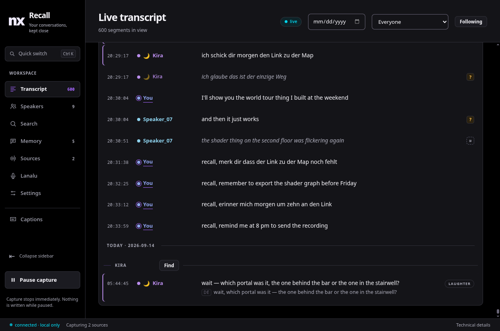
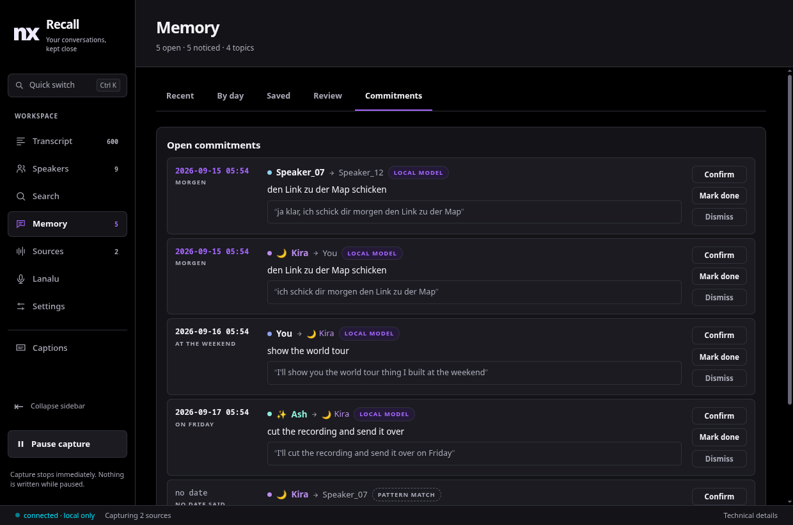
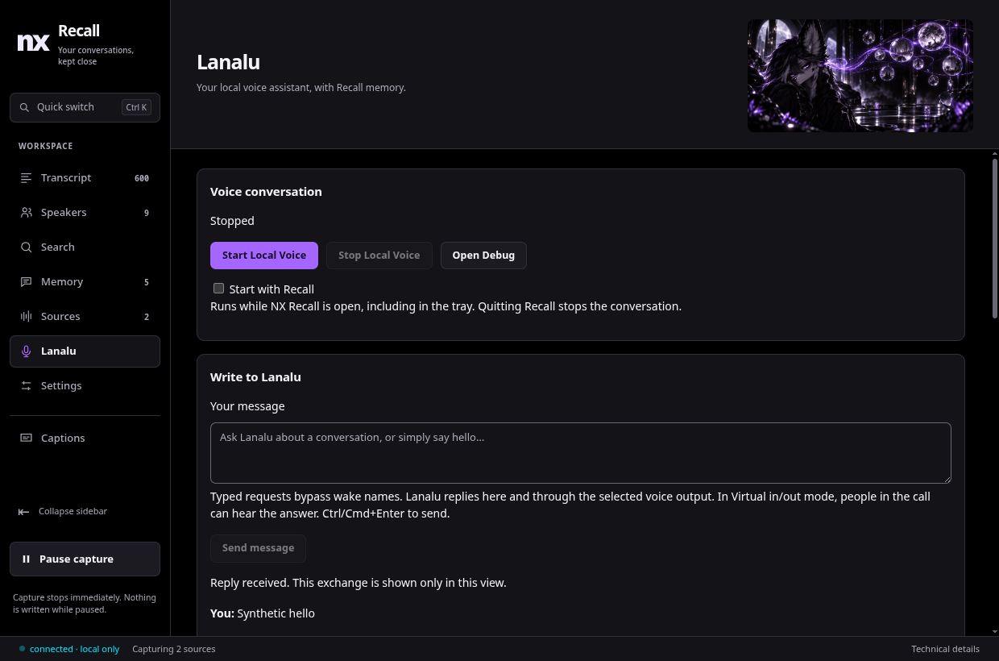
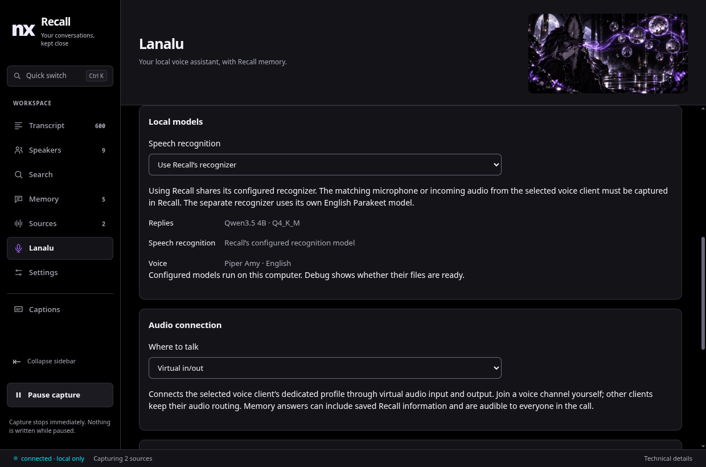
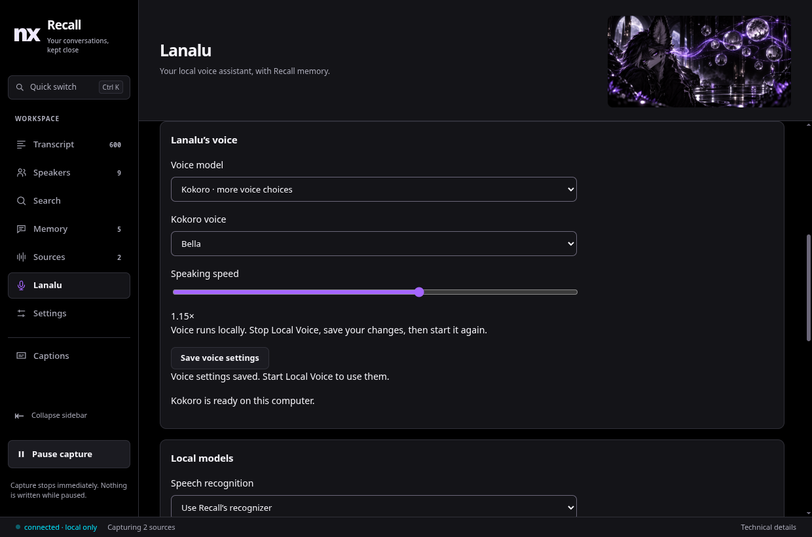

<div align="center">


# Good conversations deserve a memory.

**Find the world they mentioned. Remember the promise you made. Pick up where you left off.**

A local conversation archive for Linux, with live transcription, speaker recognition,
search by meaning, and **Lanalu** — a voice you can ask about your memories.

[](https://github.com/nerdrx/nx-recall/releases/latest)
[](#from-install-to-first-memory)
[](#your-conversations-stay-yours)

[See it in action](#the-words-the-people-the-context) · [Meet Lanalu](#meet-lanalu-your-archive-has-a-voice) · [Install with NX Hub](https://github.com/nerdrx/nx-hub)

</div>

<br>

## The words. The people. The context.

You remember the conversation. Recall helps you find the part that matters.



<sub>Actual desktop UI with fictional demonstration conversations. Screenshots throughout use test data.</sub>

| “What was that world called?” | “Who said they'd send the link?” | “I want to keep this bit.” |
| :--- | :--- | :--- |
| Search the words you remember, or use optional **semantic search** to find related meaning. Open a result in its conversation. | Follow **named speakers**, revisit a person's conversations, and review commitments with their source turns. | Save a **moment**, add a note, collect related conversations, or export them to Markdown. |

**Listen now, revisit later.** Live captions and transcripts follow permitted audio sources.
Replay the original audio while it is retained. Correct uncertain words without losing
where they came from. Speaker labels expose uncertainty instead of pretending every match is certain.

## More than a wall of transcripts.

Your archive has places to return to: conversations, people, topics, notes, and the things
you still meant to do. Optional local models help summarize and connect the recorded words.



**Teach it the spellings you care about.** Optional experimental [corrected-name assistance](docs/NAME-ASSISTANCE.md) uses trusted names as acoustic hints for future transcripts. It preserves the other recognized words and does not retrain model weights.

**Keep the original close.** A summary is a starting point. Source turns let you check it.
Saved moments, collections and recorded days remain useful without enabling a language model.

<br>

## Meet Lanalu. Your archive has a voice.


**Ask out loud. Or type when the room is quiet.**

Lanalu is Recall's local voice assistant, with her own tab, written conversation input,
and a Debug window that shows whether she is listening, thinking, speaking, or waiting on something.

Try asking about a remembered conversation: *“Lanalu, what did we say about the world tour?”*
Relevant Recall excerpts can help her answer. If the archive does not contain the answer,
she should say so; model replies can still be wrong, so check the original conversation when it matters.



| Your computer | Virtual in/out |
| :--- | :--- |
| Choose a microphone and speakers or headphones. Type or speak. Local playback pauses listening briefly to reduce feedback. | Connect the selected voice client. Private virtual audio devices carry incoming speech and Lanalu's replies. Incoming speech can interrupt her. |

**One recognizer, or a separate one — your choice.** The default reuses Recall's words
for the matching captured input. Switch to separate recognition when that input is not
being recorded by Recall. Choose wake names such as “Lanalu”, or respond to each detected turn.

<details>
<summary><strong>See the listening and recognition controls</strong></summary>



</details>

Confident, recent **named acoustic matches** can identify a speaker on the selected virtual input. Generic
speaker labels, overlapping voices and uncertain matches stay unknown. Local microphone
mode currently leaves the speaker unnamed. A voice match is not authorization.

**No paid inference API.** Qwen3.5-4B prepares replies locally. Choose fast Amy speech or one of four optional Kokoro voices, adjust the pace, and make Lanalu sound right for you.
The same Qwen model is available to Recall's memory writer. Shared recognition uses
Recall's selected speech model; separate recognition uses English Parakeet.

<details>
<summary><strong>Audio, privacy and setup details</strong></summary>

Lanalu belongs to the desktop app. She can continue in the tray and stops when you
quit Recall. Setup downloads models but does not start listening. Optional autostart
is a separate choice.

Your voice client stays human-controlled: you log in and join the call. Recall does not automate
the Discord account. Other Discord clients and desktop audio defaults are left alone.
Stopping Local Voice restores the routes it changed.

In a call, **memory answers are audible to everyone present** and may include saved
Recall information. Remote microphones can echo; the routing is not an acoustic echo canceller.
The included voice choices and separate recognizer use English.

[Local Voice setup, models and limitations →](docs/LOCAL-VOICE.md)

</details>

<br>

<details>
<summary><strong>Choose Lanalu’s voice</strong></summary>



Amy is the fast default. Kokoro begins playback as native sentence chunks arrive. Optional Kokoro voices are Heart, Bella, Sarah and Nicole. All run locally. Amy also has a voice-variation control; both engines support speaking speed.

</details>

## Your conversations stay yours.

**Capture is a choice.** Recall records applications you allow and microphones you enable.
Audio, transcripts, speaker fingerprints and search data stay on your machine for local
processing. No cloud transcription. No telemetry.

| Choose what is heard | Decide what stays | Take your archive with you |
| :--- | :--- | :--- |
| Manage sources and pause capture from the app or tray. | Set audio retention, delete records, and review uncertain recognition. | Export Markdown and create verified backups. |

Installation, model setup and updates download files. Local inference does not send
conversations to an inference API. Your voice client transmits generated replies when you enable call output.

## From install to first memory.

**Linux x86-64 · PipeWire · systemd user session**

1. **Install Recall.** Use [NX Hub](https://github.com/nerdrx/nx-hub) or the [latest release](https://github.com/nerdrx/nx-recall/releases/latest). The package includes the daemon, desktop app, tray and captions overlay.
2. **Choose your sources.** Prepare the base speech models, start the service, then allow the applications or microphone you want in **Sources**.
3. **Make it yours.** Name familiar voices, save a moment, or open **Lanalu → Set up Local Voice** when you want spoken conversation.

<details>
<summary><strong>First-run commands and optional models</strong></summary>

```bash
~/.local/bin/recalld models fetch
systemctl --user daemon-reload
systemctl --user enable --now nx-recall
```

Optional semantic search and conversation summaries:

```bash
~/.local/bin/recalld models fetch --semantic
~/.local/bin/recalld models fetch --graph
```

Local Voice setup downloads about **3 GB** of models plus Python packages, reusing
existing files. Allow at least **4 GB free disk space**. It requires Python 3.11+,
FFmpeg, PipeWire-Pulse and working Vulkan drivers. Choose audio and listening modes
before selecting **Start Local Voice**. For shared recognition, Recall must capture the same input.

Updates and uninstall preserve data and models under `~/.local/share/nx-recall`.
[Complete installation reference →](docs/REFERENCE.md#install-on-linux)

</details>

## Open it up.

Rust recording daemon. SQLite archive. Electron desktop. Optional Python voice worker.
Recall exposes processing delays and recording gaps, and keeps its interfaces documented.

| Explore | Read |
| :--- | :--- |
| **Use Recall** | [Local Voice](docs/LOCAL-VOICE.md) · [Desktop UI](docs/UI.md) · [Installation reference](docs/REFERENCE.md#install-on-linux) |
| **Build and extend** | [Build from source](docs/REFERENCE.md#build-from-source) · [Protocol](docs/PROTOCOL.md) · [Design](docs/DESIGN.md) |
| **Understand the boundaries** | [Reliability](docs/RELIABILITY.md) · [Measurements](spike/FINDINGS.md) · [Memory graph](docs/GRAPH.md) |
| **Follow development** | [Changelog](CHANGELOG.md) · [Releases](https://github.com/nerdrx/nx-recall/releases) · [Issues](https://github.com/nerdrx/nx-recall/issues) |

Desktop captions use a native Wayland surface. The [OpenXR headset overlay](docs/OVERLAY.md)
is experimental and has not been validated in a live WiVRn session.

---

<div align="center">

### Same people. More remembered.

**Your lobbies. Your people. Your memory.**

[**Get NX Recall**](https://github.com/nerdrx/nx-recall/releases/latest) · [Explore the NX family](https://github.com/nerdrx/nx-hub)

</div>
