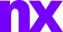

# NX compact wordmark

Canonical artwork for [The NX Design Language v1.8, §8.1](https://github.com/nerdrx/nx-hub/blob/main/docs/DESIGN.md#81-compact-nx-wordmark-v18).

| File | Fill |
| --- | --- |
| `nx-wordmark.svg` | `currentColor`; use inline to inherit theme ink. External images default to black. |
| `nx-wordmark-light.svg` | `#EFEAFF`, for dark backgrounds. |
| `nx-wordmark-violet.svg` | Exact NX brand violet `#7700FF`. |

All three share identical outlined paths and a `1098 552` viewBox. No font
loading, scripts, external resources, embedded raster images, or filters.
Preserve proportions. Use 24–32px visible height in headers (16px minimum),
with at least half that height as surrounding clear space. See the guide for
accessibility, theme selection, and the cross-project rollout checklist.

## Provenance

Approved by the user from the NX showcase's simple lowercase `nx` signature on
2026-09-09. The original CSS used Geist, weight 900, at 40px with −5px tracking
(−0.125em). These paths were extracted from the locally built site's Geist
variable font at weight 900 using fontTools, positioned at that tracking, and
normalized to their tight visible bounds. No font files need to be distributed
or installed to use the artwork. UI typography remains the system stack.

Geist font source: Copyright 2024 The Geist Project Authors
(https://github.com/vercel/geist-font), licensed under the SIL Open Font License
1.1 (https://openfontlicense.org). These assets are outlined artwork, not a
modified or redistributed font program.

The existing crystal app/launcher/tray artwork remains in the parent `assets/`
directory. Applying this wordmark to other projects is a separate rollout.
